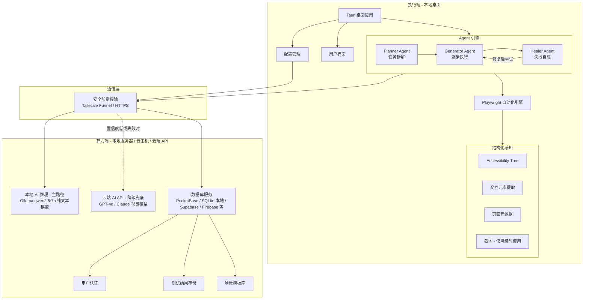
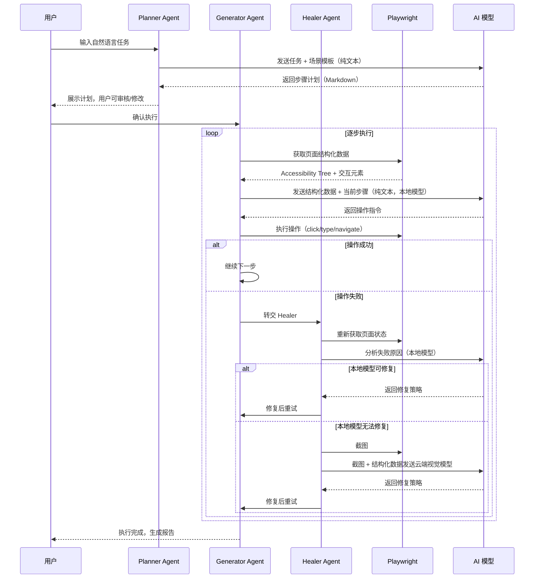

# LogicGuard AI 开发文档

## 1. 项目概述

LogicGuard AI 是一个全链路自动化测试系统，采用 "本地执行 + 远程推理" 的分布式架构，核心采用 **Planner → Generator → Healer 三层 Agent 架构**，以 **结构化页面感知（Accessibility Tree + 交互元素提取）+ 本地模型** 为主路径，云端视觉 API 为降级兜底，支持灵活的算力端部署和多种 AI 大模型、数据库后端，可按需选择本地私有化或云端托管方案。

### 1.1 核心目标

- **用户体验**：实现"一键安装，开箱即用"的测试工具
- **技术架构**：采用"本地执行 + 远程推理"的分布式架构，Planner-Generator-Healer 三层 Agent 协同工作
- **AI 友好**：以结构化数据（Accessibility Tree + 精简 HTML）作为 AI 主要输入，降低对大模型视觉能力的依赖，确保本地 7B 模型即可胜任
- **灵活部署**：算力端、大模型、数据库均支持本地与云端自由切换
- **成本控制**：可利用现有硬件资源私有化部署，也可按需接入云端服务
- **自愈能力**：内置 Healer Agent 自动诊断和修复失败操作，减少人工干预

### 1.2 系统架构

- **算力端**：可部署在任意服务器、个人电脑或云主机，运行 AI 推理服务和后端数据库；也可直接对接云端 AI API 和云数据库，无需自建算力
- **执行端**：任何 Windows/macOS/Linux 桌面电脑，运行 Tauri 桌面应用
- **通信桥梁**：支持 Tailscale Funnel（内网穿透）或直接访问云端服务，确保执行端能安全访问算力端

## 2. 技术栈

| 类别    | 技术                                          | 版本    | 用途                  |
| ----- | ------------------------------------------- | ----- | ------------------- |
| 前端框架  | React                                       | 18+   | 构建用户界面              |
| 构建工具  | Vite                                        | 5+    | 项目构建和开发服务器          |
| 样式框架  | Tailwind CSS                                | 4+    | 响应式 UI 设计           |
| 桌面应用  | Tauri                                       | 2.0   | 跨平台桌面应用             |
| 自动化测试 | Playwright                                  | 1.40+ | 浏览器自动化              |
| 大语言模型 | Ollama（本地）/ OpenAI / Claude / 通义千问 等（云端）   | -     | AI 推理和意图解析，可按需切换    |
| 后端数据库 | PocketBase / SQLite（本地）/ Supabase / Firebase 等（云端） | -     | 用户认证和数据存储，支持本地与云端替换 |
| 内网穿透  | Tailscale Funnel（本地算力端）/ 直连云端服务             | 最新版   | 远程访问服务              |

## 3. 系统设计

### 3.1 架构设计



### 3.2 三层 Agent 工作流



### 3.3 模块划分

| 模块    | 职责                    | 文件位置              | 技术实现                          |
| ----- | --------------------- | ----------------- | ----------------------------- |
| 桌面应用  | 用户界面和交互               | `src/`            | Tauri + React                 |
| Agent 引擎 | Planner / Generator / Healer 三层协同 | `src/agents/` | TypeScript，统一 Agent 接口 |
| 页面感知层 | Accessibility Tree + 交互元素提取 + 截图 | `src/perception/` | Playwright API |
| 自动化引擎 | 浏览器控制和操作执行            | `src/automation/` | Playwright                    |
| AI 接口 | 统一 AI 调用，本地优先 + 云端降级  | `src/ai/`         | Fetch API / OpenAI SDK 兼容接口   |
| 场景模板  | 预置和自定义测试场景模板          | `src/templates/`  | JSON/YAML 模板文件               |
| 数据同步  | 与数据库服务通信，支持本地与云端替换    | `src/api/`        | 适配器模式，兼容 PocketBase / REST API |
| 配置管理  | 应用配置和存储，包含 AI 和数据库连接配置 | `src/config/`     | localStorage                  |
| 工具函数  | 通用功能和辅助方法             | `src/utils/`      | TypeScript                    |

## 4. 详细设计

### 4.1 桌面应用设计

#### 4.1.1 主界面布局

- **侧边栏**：任务列表、设置、报告
- **主区域**：测试执行面板、AI 交互界面
- **状态栏**：网络状态、AI 连接状态、版本信息

#### 4.1.2 核心页面

- **登录页面**：用户认证和授权
- **任务列表**：测试任务管理和执行
- **设置页面**：系统配置和连接管理
- **报告页面**：测试结果查看和导出

### 4.2 页面感知层设计（AI 友好，本地模型优先）

> **核心原则**：以结构化数据作为 AI 主要输入，避免依赖截图分析，确保本地 7B 纯文本模型即可胜任 80%+ 的场景。

#### 4.2.1 感知数据分层

| 层级 | 数据类型 | Token 开销 | 使用时机 | 本地模型可用 |
| --- | --- | --- | --- | --- |
| L1 基础 | 页面元数据（URL、标题、表单状态） | ~50 tokens | 每次操作必传 | ✅ |
| L2 核心 | 交互元素列表（按钮、输入框、链接等） | ~200-500 tokens | 每次操作必传 | ✅ |
| L3 补充 | Accessibility Tree 快照 | ~300-800 tokens | 元素列表不足时 | ✅ |
| L4 降级 | 页面截图（JPEG, quality=50） | ~1000+ tokens | 仅 Healer 云端降级时 | ❌ 需云端视觉模型 |

#### 4.2.2 结构化感知实现

```typescript
// 页面感知上下文（发送给 AI 的核心数据，全是纯文本，本地 7B 模型可处理）
interface PageContext {
  url: string;                    // 当前页面 URL
  title: string;                  // 页面标题
  interactiveElements: InteractiveElement[];  // 可交互元素列表
  accessibilityTree?: string;     // Accessibility Tree 快照（L3 补充）
}

interface InteractiveElement {
  index: number;                  // 元素编号（AI 通过编号选择）
  tag: string;                    // HTML 标签：BUTTON, INPUT, A, SELECT...
  text: string;                   // 元素文本内容（截取前 50 字符）
  type?: string;                  // input type: text, password, submit...
  placeholder?: string;           // 占位符文本
  role?: string;                  // ARIA role
  disabled?: boolean;             // 是否禁用
  selector: string;               // 自动生成的唯一 CSS 选择器
}
```

**发送给本地模型的数据示例**（纯文本，约 300 tokens）：

```json
{
  "task": "点击同意按钮",
  "page": {
    "url": "https://oa.company.com/approval/123",
    "title": "请假审批 - 张三"
  },
  "elements": [
    { "index": 0, "tag": "BUTTON", "text": "同意", "selector": "#btn-approve" },
    { "index": 1, "tag": "BUTTON", "text": "驳回", "selector": "#btn-reject" },
    { "index": 2, "tag": "INPUT", "placeholder": "请输入审批意见", "selector": "#comment" }
  ]
}
```

> 本地 qwen2.5:7b 可以轻松判断：选择 index 0，执行 `click("#btn-approve")`。**无需截图，无需视觉模型。**

#### 4.2.3 浏览器控制

- **启动模式**：使用 `launchPersistentContext` 加载用户 Chrome Profile（SSO 穿透）
- **操作类型**：点击、输入、导航、滚动、等待
- **视觉反馈**：点击位置红点动画
- **Profile 安全**：复制 Profile 到临时目录，避免锁冲突和数据损坏

### 4.3 三层 Agent 设计

#### 4.3.1 Planner Agent（任务规划）

**职责**：接收用户自然语言任务，拆解为分步执行计划。

- **输入**：用户任务描述 + 场景模板（可选）
- **输出**：Markdown 格式的步骤计划
- **模型要求**：纯文本推理，**本地 7B 模型可胜任**
- **Token 开销**：约 200-500 tokens/次

```typescript
interface PlannerInput {
  task: string;                   // 用户自然语言任务
  template?: ScenarioTemplate;    // 匹配的场景模板（可选）
  history?: string[];             // 历史执行记录（可选）
}

interface PlannerOutput {
  planId: string;
  steps: PlanStep[];
  estimatedTime: number;          // 预计耗时（秒）
}

interface PlanStep {
  stepId: number;
  description: string;            // 人类可读的步骤描述
  expectedAction: string;         // 预期操作类型
  successCriteria: string;        // 成功判断条件
}
```

**Planner Prompt 示例**（发给本地模型的提示词）：

```
你是一个测试任务规划师。请将以下任务拆解为具体的操作步骤。
每个步骤应包含：操作描述、预期操作类型（navigate/click/type/wait/assert）、成功条件。

任务：登录 OA 系统并提交一个请假申请
场景模板提示：先导航到登录页，输入账号密码，点击登录，然后进入请假模块...

请以 JSON 格式返回步骤列表。
```

#### 4.3.2 Generator Agent（逐步执行）

**职责**：按照 Planner 生成的计划，逐步获取页面上下文、调用 AI 决策、驱动 Playwright 执行。

- **输入**：当前步骤 + 页面结构化上下文（L1-L3 数据）
- **输出**：具体操作指令
- **模型要求**：纯文本推理（结构化数据 → 选择元素），**本地 7B 模型可胜任**
- **Token 开销**：约 300-600 tokens/次

```typescript
interface GeneratorInput {
  currentStep: PlanStep;          // 当前要执行的步骤
  pageContext: PageContext;        // 页面结构化感知数据
  previousActions?: ActionResult[]; // 前几步的执行结果
}

interface GeneratorOutput {
  action: 'click' | 'type' | 'navigate' | 'scroll' | 'wait' | 'select';
  target: string;                 // CSS 选择器（从元素列表中选取）
  value?: string;                 // 输入值
  reason: string;                 // 决策理由
  confidence: number;             // 置信度 0-1
}
```

#### 4.3.3 Healer Agent（失败自愈）

**职责**：当 Generator 执行失败时，自动诊断原因并尝试修复。

- **自愈策略分级**（从低成本到高成本）：

| 级别 | 策略 | 模型要求 | 说明 |
| --- | --- | --- | --- |
| H1 | 重试（等待后重新执行） | 无需 AI | 元素可能尚未加载，等待后重试 |
| H2 | 换选择器（尝试备选定位方式） | 无需 AI | 从 text/role/xpath 等多策略 fallback |
| H3 | 重新感知（重新获取页面上下文） | 本地 7B ✅ | 页面可能发生了跳转或动态变化 |
| H4 | AI 诊断（分析失败原因） | 本地 7B ✅ | 发送错误信息 + 页面上下文给本地模型分析 |
| H5 | 云端视觉降级 | 云端视觉 ⚠️ | 截图 + 结构化数据发给 GPT-4o/Claude 兜底 |

```typescript
interface HealerInput {
  failedStep: PlanStep;           // 失败的步骤
  failedAction: GeneratorOutput;  // 失败的操作
  error: string;                  // 错误信息
  pageContext: PageContext;        // 当前页面状态
  retryCount: number;             // 已重试次数
}

interface HealerOutput {
  strategy: 'retry' | 'alt_selector' | 're_perceive' | 'ai_diagnose' | 'cloud_fallback' | 'skip' | 'abort';
  fixedAction?: GeneratorOutput;  // 修复后的操作
  reason: string;                 // 修复理由
  maxRetries: number;             // 该策略最大重试次数，默认 3
}
```

**Healer 决策流程**：

```
操作失败 → H1 重试（最多 2 次）
  ↓ 仍然失败
H2 换选择器（text → role → xpath → nth-child）
  ↓ 仍然失败
H3 重新感知页面（可能页面已变化）→ 本地 AI 重新决策
  ↓ 仍然失败
H4 本地 AI 诊断（发送错误 + 上下文，分析根因）
  ↓ 本地模型置信度 < 0.5
H5 截图 + 上下文 → 云端视觉模型兜底
  ↓ 仍然失败（超过最大重试 3 次）
标记步骤失败，记录日志，询问用户是否跳过
```

#### 4.3.4 AI 模型适配层

系统通过统一的 AI 适配器接口屏蔽底层模型差异：

| 角色 | 推荐模型 | 显存需求 | 说明 |
| --- | --- | --- | --- |
| **主路径（文本推理）** | Ollama qwen2.5:7b | ~6GB | Planner / Generator / Healer H1-H4 全部使用 |
| **降级兜底（视觉）** | GPT-4o / Claude 3.5 | 云端 | 仅 Healer H5 使用，约 ¥0.1-0.3/次 |
| **备选本地** | deepseek-v3 / llama3.1:8b | ~6-8GB | 可替换 qwen2.5 作为本地主模型 |

切换模型只需在配置中修改 `aiProvider`、`apiBaseUrl` 和 `apiKey`，业务代码无需改动。

### 4.4 场景模板系统设计

#### 4.4.1 模板概念

场景模板类似于 Playwright Test Agents 中的 `seed.spec.ts`，为 AI 提供领域知识和操作参考，大幅提升 Planner 的规划质量和 Generator 的决策准确率。

**为什么需要模板**：没有模板时，本地 7B 模型对"登录 OA 系统"的理解可能很模糊；有模板后，模型获得了明确的步骤参考，相当于开卷考试。

#### 4.4.2 模板结构

```typescript
interface ScenarioTemplate {
  id: string;
  name: string;                   // 模板名称：如"OA 登录"
  category: string;               // 分类：login / form / approval / query
  description: string;            // 模板描述
  targetUrl?: string;             // 目标系统 URL 模式（支持通配符）
  steps: TemplateStep[];          // 参考步骤
  variables: TemplateVariable[];  // 可配置变量
  tags: string[];                 // 标签，用于模板匹配
}

interface TemplateStep {
  order: number;
  description: string;            // 步骤描述
  action: string;                 // 操作类型
  selectorHint?: string;          // 选择器提示（不是硬编码，是给 AI 的参考）
  waitCondition?: string;         // 等待条件
}

interface TemplateVariable {
  name: string;                   // 变量名：如 username, password
  label: string;                  // 显示名：如"用户名"
  type: 'text' | 'password' | 'select';
  required: boolean;
  defaultValue?: string;
}
```

#### 4.4.3 预置模板示例

```json
{
  "id": "tpl_oa_login",
  "name": "OA 系统登录",
  "category": "login",
  "description": "通用 OA/ERP 系统登录流程",
  "steps": [
    { "order": 1, "description": "导航到登录页面", "action": "navigate" },
    { "order": 2, "description": "输入用户名", "action": "type", "selectorHint": "用户名/账号输入框" },
    { "order": 3, "description": "输入密码", "action": "type", "selectorHint": "密码输入框" },
    { "order": 4, "description": "点击登录按钮", "action": "click", "selectorHint": "登录/提交按钮" },
    { "order": 5, "description": "等待登录成功", "action": "wait", "waitCondition": "URL 变化或出现首页元素" }
  ],
  "variables": [
    { "name": "loginUrl", "label": "登录地址", "type": "text", "required": true },
    { "name": "username", "label": "用户名", "type": "text", "required": true },
    { "name": "password", "label": "密码", "type": "password", "required": true }
  ],
  "tags": ["login", "oa", "erp", "sso"]
}
```

#### 4.4.4 模板匹配与学习

- **自动匹配**：根据用户任务描述中的关键词和目标 URL，自动推荐最佳匹配模板
- **用户自定义**：支持用户从成功的测试执行中"另存为模板"
- **模板共享**：团队成员可通过数据库同步共享自定义模板

### 4.5 数据同步设计

#### 4.5.1 多数据库适配架构

系统通过统一的数据访问适配器接口屏蔽底层数据库差异，支持以下后端：

| 模式   | 实现方案                              | 适用场景              |
| ---- | --------------------------------- | ----------------- |
| 本地数据库 | PocketBase（内嵌 SQLite，自带认证和 REST API） | 私有化部署，零依赖，开箱即用    |
| 本地轻量 | SQLite + 自建 API                   | 极简部署，完全离线         |
| 云端托管 | Supabase（PostgreSQL + 认证）         | 云端托管，免运维，支持多端同步   |
| 云端 BaaS | Firebase Firestore               | 实时同步，Google 生态    |

切换数据库只需在配置中修改 `dbProvider` 和 `dbBaseUrl`，业务代码通过适配器层透明访问。

#### 4.5.2 用户认证

- **注册流程**：邮箱验证和密码设置
- **登录流程**：JWT token 生成和存储
- **权限管理**：基于角色的访问控制

#### 4.5.3 数据模型

```typescript
// 用户模型
interface User {
  id: string;
  email: string;
  name: string;
  role: 'admin' | 'user';
  createdAt: string;
  updatedAt: string;
}

// 测试结果模型
interface TestResult {
  id: string;
  userId: string;
  testName: string;
  testStatus: 'success' | 'failed' | 'pending';
  testReport: string; // Markdown 格式
  screenshot?: string; // 失败时的截图
  createdAt: string;
  updatedAt: string;
}
```

## 5. API 设计

### 5.1 内部 API

#### 5.1.1 页面感知 API

```typescript
// 获取页面结构化上下文（主路径，不截图）
function getPageContext(page: Page): Promise<PageContext>;

// 获取交互元素列表
function getInteractiveElements(page: Page): Promise<InteractiveElement[]>;

// 获取 Accessibility Tree 快照
function getAccessibilityTree(page: Page): Promise<string>;

// 截图（仅 Healer 云端降级时使用）
function screenshot(page: Page): Promise<string>;
```

#### 5.1.2 Agent 引擎 API

```typescript
// Planner：任务规划
function planTask(task: string, template?: ScenarioTemplate): Promise<PlannerOutput>;

// Generator：逐步执行
function executeStep(step: PlanStep, pageContext: PageContext): Promise<GeneratorOutput>;

// Healer：失败自愈
function healFailure(input: HealerInput): Promise<HealerOutput>;

// 生成测试报告
function generateReport(testResult: TestResult): Promise<string>;
```

#### 5.1.3 自动化引擎 API

```typescript
// 启动浏览器（加载用户 Chrome Profile）
function launchBrowser(profilePath?: string): Promise<BrowserContext>;

// 执行操作（由 Generator 调用）
function executeAction(action: GeneratorOutput, page: Page): Promise<ActionResult>;

// 关闭浏览器
function closeBrowser(): Promise<void>;
```

#### 5.1.4 场景模板 API

```typescript
// 匹配场景模板
function matchTemplate(task: string, url?: string): Promise<ScenarioTemplate | null>;

// 获取模板列表
function getTemplates(category?: string): Promise<ScenarioTemplate[]>;

// 从执行记录创建模板
function createTemplateFromExecution(executionLog: ExecutionLog): Promise<ScenarioTemplate>;
```

#### 5.1.5 数据同步 API

```typescript
// 用户登录
function login(email: string, password: string): Promise<{ token: string; user: User }>;

// 上传测试结果
function uploadTestResult(result: Omit<TestResult, 'id' | 'createdAt' | 'updatedAt'>): Promise<TestResult>;

// 获取测试结果列表
function getTestResults(userId: string): Promise<TestResult[]>;

// 同步场景模板
function syncTemplates(): Promise<ScenarioTemplate[]>;

// 检查更新
function checkUpdate(): Promise<{ hasUpdate: boolean; version: string; url: string }>;
```

### 5.2 外部 API

#### 5.2.1 AI 推理服务 API

系统统一使用 OpenAI 兼容接口规范，所有支持的 AI 后端均通过此格式对接：

- **本地 Ollama**：`http://<算力端地址>/api/generate` 或 `/v1/chat/completions`（OpenAI 兼容模式）
- **OpenAI / Azure OpenAI**：`https://api.openai.com/v1/chat/completions`
- **通义千问**：`https://dashscope.aliyuncs.com/compatible-mode/v1/chat/completions`
- **其他云端模型**：任何兼容 OpenAI Chat Completions 格式的端点均可直接接入
- **认证**：Bearer token（本地 Ollama 可不填，云端 API 填入对应 API Key）

#### 5.2.2 数据库服务 API

系统通过适配器层对接不同数据库后端，默认以 PocketBase 为参考实现：

- **本地 PocketBase**：`http://<算力端地址>:8090/api/`
- **Supabase**：`https://<project-id>.supabase.co/rest/v1/`
- **认证**：Bearer token / API Key（各后端格式略有差异，由适配器层统一处理）
- **主要接口**（逻辑一致，路径由适配器映射）：
  - 用户登录 / 注册
  - 测试结果 CRUD
  - 用户管理

## 6. 开发计划

### 6.1 阶段一：基础设施搭建（Day 1-3）

- [ ] 安装并配置 Ollama，下载 **qwen2.5:7b** 纯文本模型（主路径模型，约 6GB 显存）
- [ ] 部署 PocketBase，创建必要的集合（含 `templates` 场景模板集合）
- [ ] 配置 Tailscale Funnel，确保远程访问
- [ ] 初始化 Tauri 项目，配置开发环境
- [ ] 配置云端 API Key（GPT-4o / Claude）作为降级兜底备用

### 6.2 阶段二：感知层 + Generator 基础（Day 4-7）

- [ ] 实现页面感知层：交互元素提取 + Accessibility Tree 获取
- [ ] 集成 Playwright 自动化引擎（`launchPersistentContext` + Profile 复制）
- [ ] 实现 AI 适配层：本地 Ollama 优先 + 云端 API 降级切换
- [ ] 实现 Generator Agent：结构化数据 → 本地模型决策 → Playwright 执行
- [ ] 验证本地 qwen2.5:7b 对结构化数据的决策准确率

### 6.3 阶段三：Planner + Healer + 模板系统（Day 8-12）

- [ ] 实现 Planner Agent：自然语言任务 → 步骤计划（用户可审核）
- [ ] 实现 Healer Agent：H1-H4 本地自愈策略 + H5 云端降级
- [ ] 实现场景模板系统：预置模板 + 自动匹配 + 模板编辑器
- [ ] 实现 Tauri 主界面：任务输入、计划审核、执行面板、实时日志
- [ ] 预置 5+ 常用场景模板（登录、表单、审批、查询、导出）

### 6.4 阶段四：功能完善（Day 13-16）

- [ ] 实现用户认证和权限管理
- [ ] 开发测试结果存储和报告系统
- [ ] 实现"另存为模板"功能（从成功执行中学习）
- [ ] 添加自动更新功能
- [ ] 优化用户界面和交互体验

### 6.5 阶段五：测试与部署（Day 17-20）

- [ ] 进行单元测试和集成测试
- [ ] 测试本地模型在不同场景下的成功率和 Token 开销
- [ ] 测试 Healer 自愈成功率和云端降级触发频率
- [ ] 打包发布第一个正式版本
- [ ] 邀请同事进行内测，收集反馈

### 6.6 阶段六：持续优化（Day 21+）

- [ ] 根据用户反馈进行迭代优化
- [ ] 扩展场景模板库（目标 20+ 个模板）
- [ ] 优化 Prompt 工程，提高本地模型决策准确率
- [ ] 收集 Healer 降级日志，分析本地模型瓶颈
- [ ] 增强系统稳定性和安全性

## 7. 测试策略

### 7.1 测试类型

- **单元测试**：核心功能和工具函数
- **集成测试**：模块间的交互和数据流程
- **端到端测试**：完整的测试执行流程
- **用户测试**：实际用户场景测试

### 7.2 测试工具

- **Jest**：单元测试和集成测试
- **Playwright Test**：端到端测试
- **Cypress**：UI 测试

### 7.3 质量指标

- **稳定性**：连续运行 24 小时无崩溃
- **响应时间**：AI 响应时间 < 5 秒
- **成功率**：常见测试场景成功率 > 90%
- **用户满意度**：用户反馈评分 > 4.5/5

## 8. 部署方案

### 8.1 算力端部署

算力端支持多种部署形态，可按需选择：

**方案 A：本地服务器 / 个人电脑（私有化）**
- **AI 推理**：安装 Ollama，下载所需模型，设置为系统服务开机自启
- **数据库**：部署 PocketBase，配置为后台服务
- **网络穿透**：配置 Tailscale Funnel，确保执行端可远程访问

**方案 B：云主机（自托管云端）**
- **AI 推理**：在云主机上部署 Ollama，或直接使用云厂商提供的模型推理 API
- **数据库**：在云主机上部署 PocketBase / PostgreSQL，或使用 Supabase 等托管数据库
- **网络**：直接通过公网 IP / 域名访问，无需内网穿透

**方案 C：纯云端 API（零自建算力）**
- **AI 推理**：直接对接 OpenAI、Claude、通义千问等云端 API，无需部署任何推理服务
- **数据库**：使用 Supabase、Firebase 等云端数据库服务，无需自建
- **网络**：执行端直接访问云端 API，无需算力端基础设施

### 8.2 执行端部署

- **安装包**：创建标准 Windows 安装程序
- **自动更新**：内置更新检测和安装机制
- **配置管理**：首次启动时的配置向导

### 8.3 版本管理

- **版本号**：采用语义化版本控制（MAJOR.MINOR.PATCH）
- **发布流程**：开发 → 测试 → 发布
- **回滚机制**：更新失败时自动回滚到上一版本

## 9. 安全与隐私

### 9.1 数据安全

- **传输加密**：所有数据传输使用 HTTPS
- **存储加密**：敏感信息加密存储
- **数据脱敏**：自动屏蔽敏感信息

### 9.2 访问控制

- **认证机制**：JWT token 认证
- **权限管理**：基于角色的访问控制
- **频率限制**：API 调用频率限制，防止滥用

### 9.3 隐私保护

- **数据使用**：明确的数据使用政策
- **用户 consent**：获取用户授权
- **数据删除**：支持用户数据删除

## 10. 风险评估

### 10.1 技术风险

- **网络不稳定**：实现本地缓存和重试机制
- **AI 模型响应慢**：添加超时处理和进度提示
- **浏览器兼容性**：支持多种浏览器版本

### 10.2 部署风险

- **权限问题**：自动处理 Windows 权限请求
- **依赖缺失**：打包所有必要依赖
- **配置错误**：提供配置验证和自动修复

### 10.3 安全风险

- **数据泄露**：实现端到端加密
- **滥用风险**：添加请求频率限制
- **隐私保护**：明确数据使用政策

## 11. 成功指标

- **用户接受度**：内测用户满意度 > 80%
- **使用频率**：每周活跃用户 > 5 人
- **测试覆盖**：支持 10+ 个常用测试场景
- **性能表现**：启动时间 < 5 秒，响应时间 < 2 秒
- **稳定性**：系统 uptime > 99%

## 12. 开发规范

### 12.1 代码规范

- **命名约定**：使用 PascalCase 命名组件，camelCase 命名变量和函数
- **代码风格**：遵循 ESLint 和 Prettier 规范
- **注释规范**：关键代码添加 JSDoc 注释

### 12.2 版本控制

- **分支管理**：main（稳定版）、develop（开发版）、feature/\*（特性分支）
- **提交规范**：遵循 Conventional Commits 规范
- **代码审查**：PR 必须经过代码审查

### 12.3 文档规范

- **API 文档**：使用 TypeDoc 生成 API 文档
- **开发文档**：定期更新开发文档
- **用户文档**：提供详细的用户指南

## 13. 技术支持

### 13.1 故障排查

- **日志系统**：详细的错误日志和操作日志
- **诊断工具**：内置网络和系统诊断工具
- **常见问题**：维护常见问题解答

### 13.2 升级路径

- **版本兼容性**：确保向后兼容
- **数据迁移**：提供数据迁移工具
- **升级指南**：详细的升级步骤

## 14. 未来规划

### 14.1 功能扩展

- **更多测试场景**：支持更多行业和业务场景
- **智能学习**：基于历史数据优化测试策略
- **多语言支持**：支持多语言界面

### 14.2 技术演进

- **模型优化**：使用更先进的 AI 模型
- **性能提升**：优化系统性能和响应速度
- **架构升级**：支持更多部署模式

### 14.3 生态建设

- **插件系统**：支持第三方插件
- **社区贡献**：鼓励社区贡献和反馈
- **标准化**：参与相关标准制定

***

**文档版本**：1.0.0
**最后更新**：2026-04-14
**作者**：LogicGuard AI 开发团队
