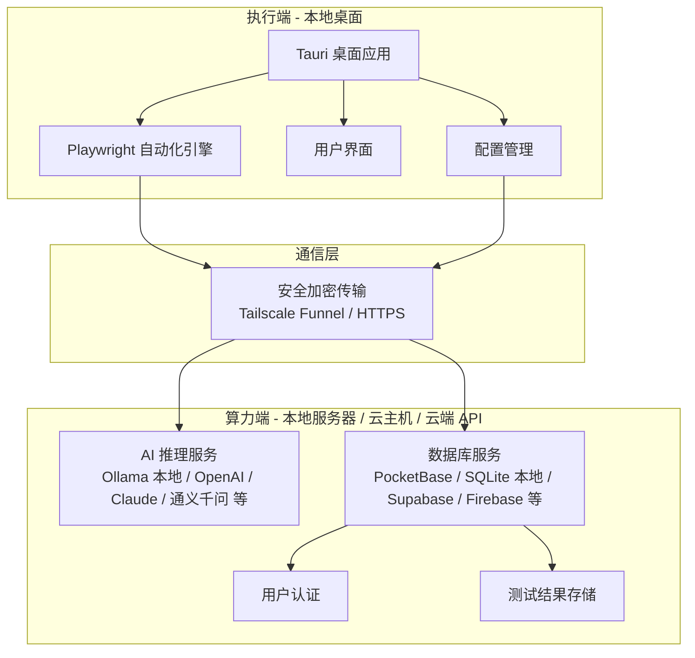

# LogicGuard AI 开发文档

## 1. 项目概述

LogicGuard AI 是一个全链路自动化测试系统，采用 "本地执行 + 远程推理" 的分布式架构，支持灵活的算力端部署和多种 AI 大模型、数据库后端，可按需选择本地私有化或云端托管方案。

### 1.1 核心目标

- **用户体验**：实现"一键安装，开箱即用"的测试工具
- **技术架构**：采用"本地执行 + 远程推理"的分布式架构
- **灵活部署**：算力端、大模型、数据库均支持本地与云端自由切换
- **成本控制**：可利用现有硬件资源私有化部署，也可按需接入云端服务

### 1.2 系统架构

- **算力端**：可部署在任意服务器、个人电脑或云主机，运行 AI 推理服务和后端数据库；也可直接对接云端 AI API 和云数据库，无需自建算力
- **执行端**：任何 Windows/macOS/Linux 桌面电脑，运行 Tauri 桌面应用
- **通信桥梁**：支持 Tailscale Funnel（内网穿透）或直接访问云端服务，确保执行端能安全访问算力端

## 2. 技术栈

| 类别    | 技术                                          | 版本    | 用途                  |
| ----- | ------------------------------------------- | ----- | ------------------- |
| 前端框架  | React                                       | 18+   | 构建用户界面              |
| 构建工具  | Vite                                        | 5+    | 项目构建和开发服务器          |
| 样式框架  | Tailwind CSS                                | 4+    | 响应式 UI 设计           |
| 桌面应用  | Tauri                                       | 2.0   | 跨平台桌面应用             |
| 自动化测试 | Playwright                                  | 1.40+ | 浏览器自动化              |
| 大语言模型 | Ollama（本地）/ OpenAI / Claude / 通义千问 等（云端）   | -     | AI 推理和意图解析，可按需切换    |
| 后端数据库 | PocketBase / SQLite（本地）/ Supabase / Firebase 等（云端） | -     | 用户认证和数据存储，支持本地与云端替换 |
| 内网穿透  | Tailscale Funnel（本地算力端）/ 直连云端服务             | 最新版   | 远程访问服务              |

## 3. 系统设计

### 3.1 架构设计



### 3.2 模块划分

| 模块    | 职责                    | 文件位置              | 技术实现                          |
| ----- | --------------------- | ----------------- | ----------------------------- |
| 桌面应用  | 用户界面和交互               | `src/`            | Tauri + React                 |
| 自动化引擎 | 浏览器控制和操作              | `src/automation/` | Playwright                    |
| AI 接口 | 与 AI 推理服务通信，支持多种后端切换  | `src/ai/`         | Fetch API / OpenAI SDK 兼容接口   |
| 数据同步  | 与数据库服务通信，支持本地与云端替换    | `src/api/`        | 适配器模式，兼容 PocketBase / REST API |
| 配置管理  | 应用配置和存储，包含 AI 和数据库连接配置 | `src/config/`     | localStorage                  |
| 工具函数  | 通用功能和辅助方法             | `src/utils/`      | TypeScript                    |

## 4. 详细设计

### 4.1 桌面应用设计

#### 4.1.1 主界面布局

- **侧边栏**：任务列表、设置、报告
- **主区域**：测试执行面板、AI 交互界面
- **状态栏**：网络状态、AI 连接状态、版本信息

#### 4.1.2 核心页面

- **登录页面**：用户认证和授权
- **任务列表**：测试任务管理和执行
- **设置页面**：系统配置和连接管理
- **报告页面**：测试结果查看和导出

### 4.2 自动化引擎设计

#### 4.2.1 浏览器控制

- **启动模式**：使用 `launchPersistentContext` 加载用户 Chrome Profile
- **操作类型**：点击、输入、导航、截图
- **视觉反馈**：点击位置红点动画

#### 4.2.2 异常处理

- **超时处理**：操作超时自动重试
- **元素定位**：多种定位策略 fallback
- **网络异常**：自动重连机制

### 4.3 AI 意图解析设计

#### 4.3.1 多模型适配架构

系统通过统一的 AI 适配器接口屏蔽底层模型差异，支持以下后端：

| 模式   | 实现方案                                  | 适用场景          |
| ---- | ------------------------------------- | ------------- |
| 本地推理 | Ollama（DeepSeek / Llama / Qwen 等本地模型） | 私有化部署，数据不出本地  |
| 云端 API | OpenAI GPT 系列 / Anthropic Claude      | 高质量推理，按量付费    |
| 国内云端 | 通义千问 / 文心一言 / 智谱 GLM 等                | 国内网络友好，合规需求   |

切换模型只需在配置中修改 `aiProvider`、`apiBaseUrl` 和 `apiKey`，业务代码无需改动。

#### 4.3.2 接口设计

```typescript
interface AIAnalysisRequest {
  screenshot: string; // Base64 编码的截图
  html: string; // 页面 HTML 结构
  task: string; // 测试任务描述
  context: string; // 上下文信息
}

interface AIAnalysisResponse {
  action: string; // 操作类型：click, type, navigate
  target: string; // 目标元素选择器或坐标
  value?: string; // 输入值（如果是 type 操作）
  reason: string; // AI 决策理由
  confidence: number; // 置信度
}
```

#### 4.3.3 推理流程

1. 捕获当前页面截图和 HTML
2. 构建 Prompt 发送给 Ollama
3. 解析 AI 返回的 JSON 响应
4. 执行相应的浏览器操作
5. 循环直到任务完成或失败

### 4.4 数据同步设计

#### 4.4.1 多数据库适配架构

系统通过统一的数据访问适配器接口屏蔽底层数据库差异，支持以下后端：

| 模式   | 实现方案                              | 适用场景              |
| ---- | --------------------------------- | ----------------- |
| 本地数据库 | PocketBase（内嵌 SQLite，自带认证和 REST API） | 私有化部署，零依赖，开箱即用    |
| 本地轻量 | SQLite + 自建 API                   | 极简部署，完全离线         |
| 云端托管 | Supabase（PostgreSQL + 认证）         | 云端托管，免运维，支持多端同步   |
| 云端 BaaS | Firebase Firestore               | 实时同步，Google 生态    |

切换数据库只需在配置中修改 `dbProvider` 和 `dbBaseUrl`，业务代码通过适配器层透明访问。

#### 4.4.2 用户认证

- **注册流程**：邮箱验证和密码设置
- **登录流程**：JWT token 生成和存储
- **权限管理**：基于角色的访问控制

#### 4.4.3 数据模型

```typescript
// 用户模型
interface User {
  id: string;
  email: string;
  name: string;
  role: 'admin' | 'user';
  createdAt: string;
  updatedAt: string;
}

// 测试结果模型
interface TestResult {
  id: string;
  userId: string;
  testName: string;
  testStatus: 'success' | 'failed' | 'pending';
  testReport: string; // Markdown 格式
  screenshot?: string; // 失败时的截图
  createdAt: string;
  updatedAt: string;
}
```

## 5. API 设计

### 5.1 内部 API

#### 5.1.1 自动化引擎 API

```typescript
// 启动浏览器
function launchBrowser(profilePath?: string): Promise<BrowserContext>;

// 导航到指定 URL
function navigateTo(url: string): Promise<void>;

// 点击元素
function click(selector: string | { x: number; y: number }): Promise<void>;

// 输入文本
function type(selector: string, text: string): Promise<void>;

// 截图
function screenshot(): Promise<string>; // 返回 Base64 编码

// 关闭浏览器
function closeBrowser(): Promise<void>;
```

#### 5.1.2 AI 接口 API

```typescript
// 分析页面
function analyzePage(screenshot: string, html: string, task: string): Promise<AIAnalysisResponse>;

// 生成测试报告
function generateReport(testResult: TestResult): Promise<string>; // 返回 Markdown
```

#### 5.1.3 数据同步 API

```typescript
// 用户登录
function login(email: string, password: string): Promise<{ token: string; user: User }>;

// 上传测试结果
function uploadTestResult(result: Omit<TestResult, 'id' | 'createdAt' | 'updatedAt'>): Promise<TestResult>;

// 获取测试结果列表
function getTestResults(userId: string): Promise<TestResult[]>;

// 获取应用版本
function getAppVersion(): Promise<string>;

// 检查更新
function checkUpdate(): Promise<{ hasUpdate: boolean; version: string; url: string }>;
```

### 5.2 外部 API

#### 5.2.1 AI 推理服务 API

系统统一使用 OpenAI 兼容接口规范，所有支持的 AI 后端均通过此格式对接：

- **本地 Ollama**：`http://<算力端地址>/api/generate` 或 `/v1/chat/completions`（OpenAI 兼容模式）
- **OpenAI / Azure OpenAI**：`https://api.openai.com/v1/chat/completions`
- **通义千问**：`https://dashscope.aliyuncs.com/compatible-mode/v1/chat/completions`
- **其他云端模型**：任何兼容 OpenAI Chat Completions 格式的端点均可直接接入
- **认证**：Bearer token（本地 Ollama 可不填，云端 API 填入对应 API Key）

#### 5.2.2 数据库服务 API

系统通过适配器层对接不同数据库后端，默认以 PocketBase 为参考实现：

- **本地 PocketBase**：`http://<算力端地址>:8090/api/`
- **Supabase**：`https://<project-id>.supabase.co/rest/v1/`
- **认证**：Bearer token / API Key（各后端格式略有差异，由适配器层统一处理）
- **主要接口**（逻辑一致，路径由适配器映射）：
  - 用户登录 / 注册
  - 测试结果 CRUD
  - 用户管理

## 6. 开发计划

### 6.1 阶段一：基础设施搭建（Day 1-3）

- [ ] 安装并配置 Ollama，下载 deepseek-v3 模型
- [ ] 部署 PocketBase，创建必要的集合
- [ ] 配置 Tailscale Funnel，确保远程访问
- [ ] 初始化 Tauri 项目，配置开发环境

### 6.2 阶段二：核心功能开发（Day 4-7）

- [ ] 实现 Tauri 主界面和导航
- [ ] 集成 Playwright 自动化引擎
- [ ] 实现基本的浏览器控制功能
- [ ] 对接 Ollama API，实现 AI 意图解析
- [ ] 实现简单的测试执行流程

### 6.3 阶段三：功能完善（Day 8-10）

- [ ] 实现用户认证和权限管理
- [ ] 开发测试结果存储和报告系统
- [ ] 添加自动更新功能
- [ ] 优化用户界面和交互体验
- [ ] 实现测试模板和常用场景

### 6.4 阶段四：测试与部署（Day 11-14）

- [ ] 进行单元测试和集成测试
- [ ] 性能测试和稳定性测试
- [ ] 打包发布第一个正式版本
- [ ] 邀请同事进行内测，收集反馈

### 6.5 阶段五：持续优化（Day 15+）

- [ ] 根据用户反馈进行迭代优化
- [ ] 扩展测试场景和模板库
- [ ] 优化 AI 推理速度和准确性
- [ ] 增强系统稳定性和安全性

## 7. 测试策略

### 7.1 测试类型

- **单元测试**：核心功能和工具函数
- **集成测试**：模块间的交互和数据流程
- **端到端测试**：完整的测试执行流程
- **用户测试**：实际用户场景测试

### 7.2 测试工具

- **Jest**：单元测试和集成测试
- **Playwright Test**：端到端测试
- **Cypress**：UI 测试

### 7.3 质量指标

- **稳定性**：连续运行 24 小时无崩溃
- **响应时间**：AI 响应时间 < 5 秒
- **成功率**：常见测试场景成功率 > 90%
- **用户满意度**：用户反馈评分 > 4.5/5

## 8. 部署方案

### 8.1 算力端部署

算力端支持多种部署形态，可按需选择：

**方案 A：本地服务器 / 个人电脑（私有化）**
- **AI 推理**：安装 Ollama，下载所需模型，设置为系统服务开机自启
- **数据库**：部署 PocketBase，配置为后台服务
- **网络穿透**：配置 Tailscale Funnel，确保执行端可远程访问

**方案 B：云主机（自托管云端）**
- **AI 推理**：在云主机上部署 Ollama，或直接使用云厂商提供的模型推理 API
- **数据库**：在云主机上部署 PocketBase / PostgreSQL，或使用 Supabase 等托管数据库
- **网络**：直接通过公网 IP / 域名访问，无需内网穿透

**方案 C：纯云端 API（零自建算力）**
- **AI 推理**：直接对接 OpenAI、Claude、通义千问等云端 API，无需部署任何推理服务
- **数据库**：使用 Supabase、Firebase 等云端数据库服务，无需自建
- **网络**：执行端直接访问云端 API，无需算力端基础设施

### 8.2 执行端部署

- **安装包**：创建标准 Windows 安装程序
- **自动更新**：内置更新检测和安装机制
- **配置管理**：首次启动时的配置向导

### 8.3 版本管理

- **版本号**：采用语义化版本控制（MAJOR.MINOR.PATCH）
- **发布流程**：开发 → 测试 → 发布
- **回滚机制**：更新失败时自动回滚到上一版本

## 9. 安全与隐私

### 9.1 数据安全

- **传输加密**：所有数据传输使用 HTTPS
- **存储加密**：敏感信息加密存储
- **数据脱敏**：自动屏蔽敏感信息

### 9.2 访问控制

- **认证机制**：JWT token 认证
- **权限管理**：基于角色的访问控制
- **频率限制**：API 调用频率限制，防止滥用

### 9.3 隐私保护

- **数据使用**：明确的数据使用政策
- **用户 consent**：获取用户授权
- **数据删除**：支持用户数据删除

## 10. 风险评估

### 10.1 技术风险

- **网络不稳定**：实现本地缓存和重试机制
- **AI 模型响应慢**：添加超时处理和进度提示
- **浏览器兼容性**：支持多种浏览器版本

### 10.2 部署风险

- **权限问题**：自动处理 Windows 权限请求
- **依赖缺失**：打包所有必要依赖
- **配置错误**：提供配置验证和自动修复

### 10.3 安全风险

- **数据泄露**：实现端到端加密
- **滥用风险**：添加请求频率限制
- **隐私保护**：明确数据使用政策

## 11. 成功指标

- **用户接受度**：内测用户满意度 > 80%
- **使用频率**：每周活跃用户 > 5 人
- **测试覆盖**：支持 10+ 个常用测试场景
- **性能表现**：启动时间 < 5 秒，响应时间 < 2 秒
- **稳定性**：系统 uptime > 99%

## 12. 开发规范

### 12.1 代码规范

- **命名约定**：使用 PascalCase 命名组件，camelCase 命名变量和函数
- **代码风格**：遵循 ESLint 和 Prettier 规范
- **注释规范**：关键代码添加 JSDoc 注释

### 12.2 版本控制

- **分支管理**：main（稳定版）、develop（开发版）、feature/\*（特性分支）
- **提交规范**：遵循 Conventional Commits 规范
- **代码审查**：PR 必须经过代码审查

### 12.3 文档规范

- **API 文档**：使用 TypeDoc 生成 API 文档
- **开发文档**：定期更新开发文档
- **用户文档**：提供详细的用户指南

## 13. 技术支持

### 13.1 故障排查

- **日志系统**：详细的错误日志和操作日志
- **诊断工具**：内置网络和系统诊断工具
- **常见问题**：维护常见问题解答

### 13.2 升级路径

- **版本兼容性**：确保向后兼容
- **数据迁移**：提供数据迁移工具
- **升级指南**：详细的升级步骤

## 14. 未来规划

### 14.1 功能扩展

- **更多测试场景**：支持更多行业和业务场景
- **智能学习**：基于历史数据优化测试策略
- **多语言支持**：支持多语言界面

### 14.2 技术演进

- **模型优化**：使用更先进的 AI 模型
- **性能提升**：优化系统性能和响应速度
- **架构升级**：支持更多部署模式

### 14.3 生态建设

- **插件系统**：支持第三方插件
- **社区贡献**：鼓励社区贡献和反馈
- **标准化**：参与相关标准制定

***

**文档版本**：1.0.0
**最后更新**：2026-04-14
**作者**：LogicGuard AI 开发团队
