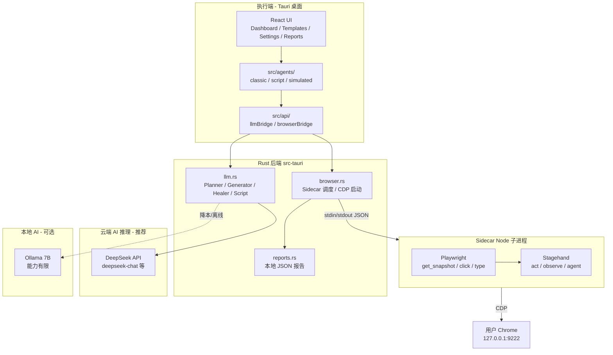
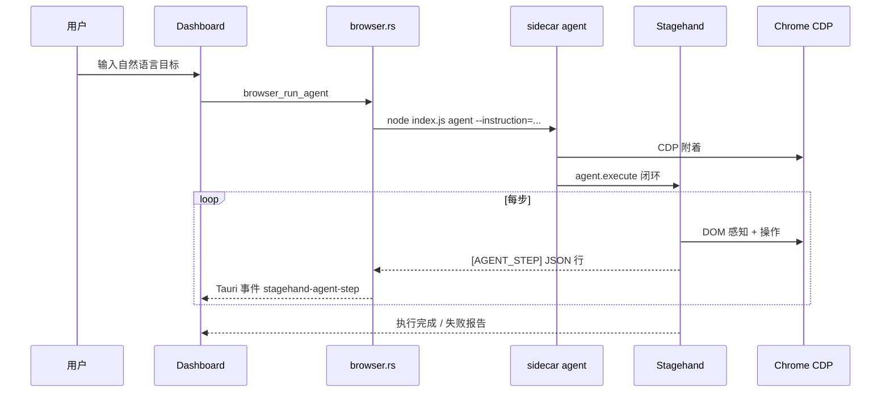
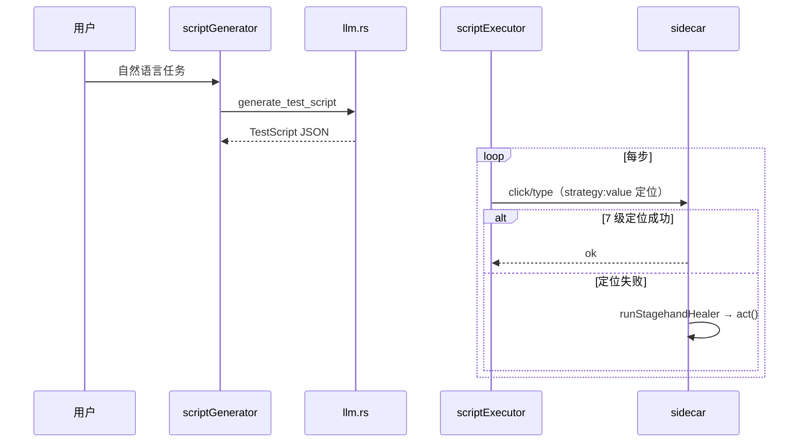
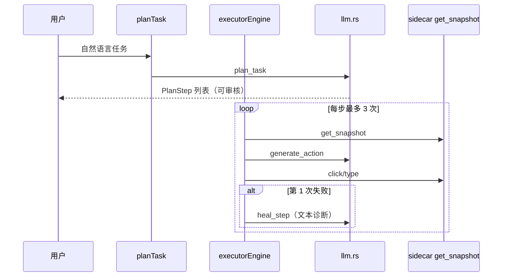
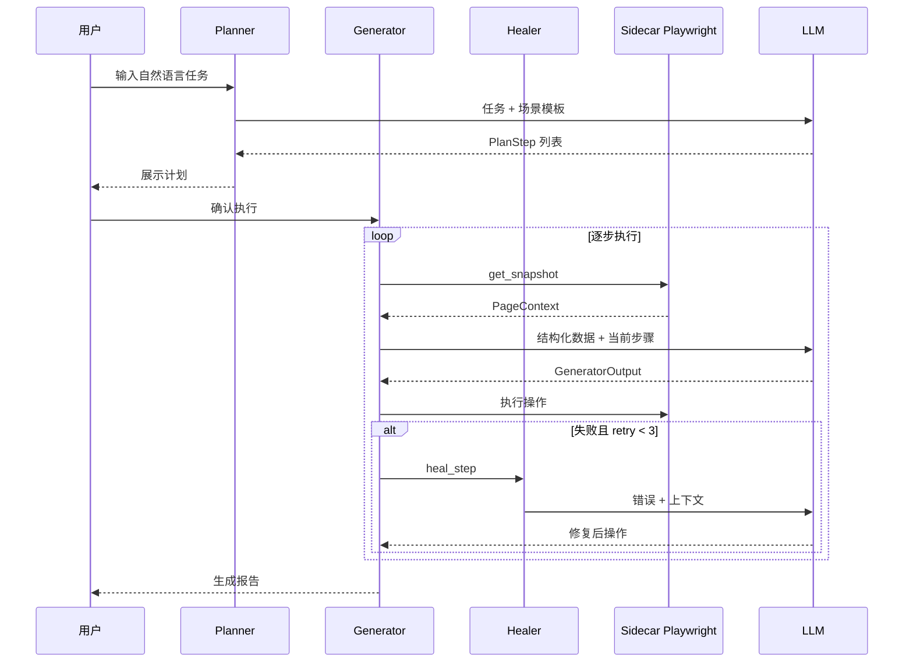

# LogicGuard AI 开发文档

## 1. 项目概述

LogicGuard AI 是一个全链路自动化测试系统，采用 **「本地浏览器执行 + 云端大模型推理」** 架构。浏览器控制在本地（Tauri + Sidecar + Chrome CDP），AI 推理**推荐接入云端付费 API**（当前团队使用 **DeepSeek**），以获得 Stagehand 闭环与 Script 生成所需的推理能力；本地 Ollama 仅作可选补充，受显存与模型规模限制，复杂场景成功率较低。

产品以 **Stagehand Agent 闭环执行** 为默认路径，同时保留 **Classic（Planner → Generator → Healer）** 与 **Script（一次生成、确定性回放）** 两种模式，以 **结构化页面感知（Accessibility Tree + 交互元素提取）** 为主输入。

> **文档说明**：本文档为唯一权威技术文档。本地 Ollama 零成本部署（可选）见 [零成本部署附录.md](./零成本部署附录.md)。

### 1.1 核心目标

- **用户体验**：实现「一键安装，开箱即用」的测试工具
- **技术架构**：Tauri 桌面应用 + Node.js Sidecar（Playwright/Stagehand）+ Rust 后端（LLM 路由）
- **AI 推理**：**推荐云端大模型 API**（DeepSeek 等 OpenAI 兼容端点）；本地 7B 模型可用于简单 Classic 场景，但 Stagehand / 复杂 Script 建议云端
- **灵活部署**：执行端本地运行；算力无需自建，直连云端 API 即可
- **自愈能力**：Healer 分级为设计目标；当前 Script/Stagehand 路径以 Stagehand `act()` / `agent()` 实现自愈

### 1.2 系统架构

- **AI 推理（推荐）**：云端付费 API，如 **DeepSeek**（`https://api.deepseek.com`），Settings 配置 API Key 后即用，无需家里算力机
- **AI 推理（可选）**：本地 Ollama / 家用 PC，适合离线或降本，但 7B 模型对 Stagehand 多步任务能力有限
- **执行端**：Windows/macOS/Linux 桌面，运行 Tauri 桌面应用 + Sidecar
- **浏览器引擎**：Sidecar 子进程通过 CDP 附着用户 Chrome，执行 Playwright 与 Stagehand 操作
- **通信**：执行端 HTTPS 直连 DeepSeek 等云端 API；仅在使用本地 Ollama 时才需要 Tailscale Funnel 内网穿透

## 2. 技术栈

| 类别 | 技术 | 版本 | 用途 |
| --- | --- | --- | --- |
| 前端框架 | React | 19+ | 用户界面 |
| 构建工具 | Vite | 8+ | 项目构建和开发服务器 |
| 样式框架 | Tailwind CSS | 4+ | 响应式 UI |
| 桌面应用 | Tauri | 2.0 | 跨平台桌面壳 |
| 浏览器自动化 | Playwright | 1.44+ | Sidecar 内 CDP 控制 |
| AI 浏览器 Agent | Stagehand | 3.4+ | 默认执行路径、Script 失败自愈 |
| 大语言模型 | **DeepSeek API（推荐）** / OpenAI 兼容 / Gemini / Ollama（可选） | - | Rust `llm.rs` 统一路由 |
| 后端持久化 | localStorage + 本地 JSON 文件 | - | 模板、报告、LLM 配置（当前实现） |
| 后端数据库 | PocketBase / Supabase 等 | - | **规划中**，Settings 仅有健康检查占位 |
| 内网穿透 | Tailscale Funnel | 最新版 | **仅本地 Ollama 场景**需要 |

## 3. 系统设计

### 3.1 架构设计（As-Built）


```mermaid
flowchart TD
    subgraph client [执行端 - Tauri 桌面]
        UI[React UI\nDashboard / Templates / Settings / Reports]
        Agents[src/agents/\nclassic / script / simulated]
        Bridge[src/api/\nllmBridge / browserBridge]
        UI --> Agents
        Agents --> Bridge
    end

    subgraph rust [Rust 后端 src-tauri]
        LLM[llm.rs\nPlanner / Generator / Healer / Script]
        Browser[browser.rs\nSidecar 调度 / CDP 启动]
        Reports[reports.rs\n本地 JSON 报告]
        Bridge --> LLM
        Bridge --> Browser
        Browser --> Reports
    end

    subgraph sidecar [Sidecar Node 子进程]
        PW[Playwright\nget_snapshot / click / type]
        SH[Stagehand\nact / observe / agent]
        PW --> SH
    end

    subgraph remote [云端 AI 推理 - 推荐]
        DeepSeek[DeepSeek API\ndeepseek-chat 等]
    end

    subgraph local_llm [本地 AI - 可选]
        Ollama[Ollama 7B\n能力有限]
    end

    Browser -->|stdin/stdout JSON| sidecar
    LLM --> DeepSeek
    LLM -.->|降本/离线| Ollama
    sidecar -->|CDP| Chrome[用户 Chrome\n127.0.0.1:9222]
```

### 3.2 实际目录结构

以下为当前代码库的真实布局（**非**早期规划中的 `src/perception/` 等目录）：

```
logicguard_ai/
├── src/                          # React 前端
│   ├── agents/                   # 执行编排
│   │   ├── executorEngine.ts     # Classic：Generator + LLM Healer 循环
│   │   ├── scriptGenerator.ts    # Script：一次性生成 TestScript
│   │   ├── scriptExecutor.ts     # Script：确定性逐步回放
│   │   ├── stagehandExecutor.ts  # Stagehand 逐步执行（已定义，当前未接入 UI）
│   │   └── simulatedEngine.ts    # 无 API Key 时的演示引擎
│   ├── api/                      # Tauri invoke 桥接
│   │   ├── llmBridge.ts          # LLM 配置 + planTask / generateAction / healStep
│   │   ├── browserBridge.ts      # 浏览器 / Stagehand 命令封装
│   │   └── templateGenerator.ts  # AI 文档 → 模板；localStorage CRUD
│   ├── templates/defaultTemplates.ts  # 3 个预置模板
│   ├── utils/domCompressor.ts    # Classic 路径 DOM Token 压缩
│   ├── pages/                    # Dashboard, Templates, Settings, Reports
│   └── types/index.ts            # 共享类型定义
├── src-tauri/src/
│   ├── llm.rs                    # 全部 LLM Provider + Prompt 构建
│   ├── browser.rs                # Sidecar 子进程管理、CDP Chrome 启动
│   ├── reports.rs                # 测试报告本地文件持久化
│   └── lib.rs                    # Tauri 命令注册
└── sidecar/
    ├── index.js                  # Playwright + Stagehand 浏览器引擎
    └── package.json              # 含 @ai-sdk/* peer 依赖
```

#### 规划未实现的目录

以下路径在早期设计中出现，**当前不存在**，职责已迁移：

| 规划路径 | 实际实现位置 |
| --- | --- |
| `src/perception/` | `sidecar/index.js` → `get_snapshot` |
| `src/automation/` | `sidecar/index.js` → `click` / `type` / `navigate` 等 |
| `src/ai/` | `src-tauri/src/llm.rs` + `src/api/llmBridge.ts` |
| `src/config/` | `llmBridge.ts`（`logicguard_llm_config`）、`templateGenerator.ts` |

### 3.3 模块职责

| 模块 | 职责 | 文件位置 | 技术实现 |
| --- | --- | --- | --- |
| 桌面应用 | 用户界面和交互 | `src/` | Tauri + React |
| 执行编排 | 三种模式的任务调度 | `src/agents/` | TypeScript |
| LLM 桥接 | 配置持久化、invoke 封装 | `src/api/llmBridge.ts` | Tauri invoke |
| 浏览器桥接 | CDP、快照、Stagehand | `src/api/browserBridge.ts` | Tauri invoke |
| Rust 后端 | LLM 路由、Sidecar 调度、报告 | `src-tauri/` | Rust |
| 浏览器引擎 | 感知、操作、Stagehand 自愈 | `sidecar/index.js` | Playwright + Stagehand |
| 场景模板 | 预置 + 自定义模板 | `src/templates/` + localStorage | TypeScript |
| 工具函数 | DOM 压缩等 | `src/utils/` | TypeScript |

### 3.4 三种执行模式

Dashboard（`src/pages/Dashboard.tsx`）提供三种模式，`activeMode` 默认为 **`stagehand`**。

#### 模式 A：Stagehand Agent（默认，推荐）


```mermaid
sequenceDiagram
    participant U as 用户
    participant UI as Dashboard
    participant Rust as browser.rs
    participant SC as sidecar agent
    participant SH as Stagehand
    participant Chrome as Chrome CDP

    U->>UI: 输入自然语言目标
    UI->>Rust: browser_run_agent
    Rust->>SC: node index.js agent --instruction=...
    SC->>Chrome: CDP 附着
    SC->>SH: agent.execute 闭环
    loop 每步
        SH->>Chrome: DOM 感知 + 操作
        SH-->>Rust: [AGENT_STEP] JSON 行
        Rust-->>UI: Tauri 事件 stagehand-agent-step
    end
    SH-->>UI: 执行完成 / 失败报告
```

- **入口**：`browser_run_agent` → sidecar `agent` 命令
- **自愈**：Stagehand 原生 `agent()` 循环内自我纠错（`excludeTools: ['screenshot']`，DOM 模式）
- **适用**：复杂多步任务、Element UI / Ant Design 下拉框等动态组件

#### 模式 B：Script（一次生成、确定性回放）


```mermaid
sequenceDiagram
    participant U as 用户
    participant SG as scriptGenerator
    participant LLM as llm.rs
    participant SE as scriptExecutor
    participant SC as sidecar

    U->>SG: 自然语言任务
    SG->>LLM: generate_test_script
    LLM-->>SG: TestScript JSON
    loop 每步
        SE->>SC: click/type（strategy:value 定位）
        alt 7 级定位成功
            SC-->>SE: ok
        else 定位失败
            SC->>SC: runStagehandHealer → act()
        end
    end
```

- **入口**：`generateTestScript` → `executeTestScript`
- **定位**：7 级 waterfall（placeholder → aria-label → text → accessible-name → role → name → testid → selector）
- **自愈**：sidecar 内 `runStagehandHealer`，日志写入 `stagehand_healer.log`
- **适用**：可重复回归、模板参数集批量测试（Templates 页）

#### 模式 C：Classic（Planner → Generator → Healer）


```mermaid
sequenceDiagram
    participant U as 用户
    participant P as planTask
    participant G as executorEngine
    participant LLM as llm.rs
    participant SC as sidecar get_snapshot

    U->>P: 自然语言任务
    P->>LLM: plan_task
    LLM-->>U: PlanStep 列表（可审核）
    loop 每步最多 3 次
        G->>SC: get_snapshot
        G->>LLM: generate_action
        G->>SC: click/type
        alt 第 1 次失败
            G->>LLM: heal_step（文本诊断）
        end
    end
```

- **入口**：`planTask` → `executeTaskLoop`（`executorEngine.ts`）
- **自愈**：第 2–3 次尝试调用 `healStep`（纯文本 LLM），**未实现** H1–H5 状态机
- **适用**：需要逐步审核计划、依赖结构化元素 index 决策的场景

#### Healer 设计目标 vs 当前实现

| 级别 | 设计策略 | Classic | Script | Stagehand |
| --- | --- | --- | --- | --- |
| H1 重试 | 等待后重试 | 循环重试（隐式） | sidecar 本地等待 ~2.5s | Agent 内置 |
| H2 换选择器 | 多策略 fallback | 未实现 | 7 级定位 waterfall | Agent 内置 |
| H3 重新感知 | 刷新页面上下文 | 每次循环重新 snapshot | 失败时重试 | Agent 内置 |
| H4 AI 诊断 | 本地模型分析 | `heal_step` | Stagehand `act()` | Agent 内置 |
| H5 云端视觉 | 截图 + 视觉模型 | **未实现** | **未实现** | 已禁用 screenshot 工具 |

> **未来收敛方向**：以 Stagehand Agent 为默认路径，Classic 保留用于可审核计划场景，逐步将 H1–H5 状态机统一到 sidecar 层。

### 3.5 Classic 三层 Agent 工作流（设计参考）

以下为 Classic 模式的设计时序，Stagehand / Script 路径见 §3.4。


```mermaid
sequenceDiagram
    participant U as 用户
    participant P as Planner
    participant G as Generator
    participant H as Healer
    participant PW as Sidecar Playwright
    participant AI as LLM

    U->>P: 输入自然语言任务
    P->>AI: 任务 + 场景模板
    AI-->>P: PlanStep 列表
    P-->>U: 展示计划
    U->>G: 确认执行
    loop 逐步执行
        G->>PW: get_snapshot
        PW-->>G: PageContext
        G->>AI: 结构化数据 + 当前步骤
        AI-->>G: GeneratorOutput
        G->>PW: 执行操作
        alt 失败且 retry < 3
            G->>H: heal_step
            H->>AI: 错误 + 上下文
            AI-->>G: 修复后操作
        end
    end
    G-->>U: 生成报告
```

## 4. 详细设计

### 4.1 桌面应用设计

#### 4.1.1 主界面布局

- **侧边栏**：Dashboard（任务执行）、Templates（场景模板）、Reports（报告）、Settings（配置）
- **主区域**：任务输入、执行控制台、Healer 诊断面板（`TaskExecutionConsole.tsx`）
- **状态栏**：Settings 页展示 Ollama / PocketBase / CDP 连接状态

#### 4.1.2 核心页面

| 页面 | 状态 | 说明 |
| --- | --- | --- |
| Dashboard | 已实现 | 三种执行模式切换、实时 Healer 日志 |
| Templates | 已实现 | 模板编辑、AI 生成模板、参数集、Stagehand 执行 |
| Settings | 已实现 | LLM 配置、Chrome CDP 启动、服务健康检查 |
| Reports | 已实现（简化版） | 本地 JSON 报告列表与 Markdown 导出 |
| 登录页 | **规划中** | 当前无用户认证，配置存 localStorage |

### 4.2 页面感知层设计

> **实现位置**：`sidecar/index.js` → `get_snapshot` 命令（非独立 `src/perception/` 模块）。

#### 4.2.1 感知数据分层

| 层级 | 数据类型 | Token 开销 | 使用时机 | 当前实现 |
| --- | --- | --- | --- | --- |
| L1 基础 | URL、标题 | ~50 tokens | 每次必传 | `get_snapshot` 返回 |
| L2 核心 | 交互元素列表 | ~200–500 tokens | Classic / Script 生成时 | AX 树 + DOM 双引擎合并 |
| L3 补充 | Accessibility Tree | ~300–800 tokens | 元素不足时 | AX 节点扁平化并入元素列表 |
| L4 降级 | 页面截图 | 高 | Healer H5 设计目标 | sidecar 有 `screenshot` 命令，**未接入** Tauri / Healer |

#### 4.2.2 结构化感知实现

类型定义以 `src/types/index.ts` 为准：

```typescript
interface PageContext {
  url: string;
  title: string;
  interactiveElements: InteractiveElement[];
}

interface InteractiveElement {
  index: number;
  tag: string;
  text: string;
  type?: string;
  placeholder?: string;
  role?: string;
  disabled?: boolean;
  selector: string;       // DOM 元素：[data-lg-id="lg-xxx"]
  x?: number;
  y?: number;
  ariaLabel?: string;
  labelText?: string;       // 关联 label 文字（表单场景）
  options?: string;         // SELECT 可选项，`|` 分隔
}
```

**双引擎提取逻辑**（`get_snapshot`）：

1. **引擎 1 — AX Tree**：`page.accessibility.snapshot()`，识别 `combobox`、`textbox` 等语义角色（适配 Element UI / Ant Design）
2. **引擎 2 — DOM 扫描**：跨 frame 提取可交互元素，注入 `data-lg-id` 属性生成稳定选择器 `[data-lg-id="lg-xxxxxxxx"]`
3. **去重与限流**：最多返回 200 个元素，防止 LLM Token 爆炸

**发送给 LLM 的数据示例**（纯文本，约 300 tokens；Classic 路径经 `domCompressor` 压缩后发送）：

```json
{
  "task": "点击同意按钮",
  "page": { "url": "https://oa.company.com/approval/123", "title": "请假审批" },
  "elements": [
    { "index": 0, "tag": "BUTTON", "text": "同意", "selector": "[data-lg-id=\"lg-a1b2c3d4\"]" }
  ]
}
```

#### 4.2.3 浏览器控制

- **启动方式**：`browser.rs` → `launch_chrome_cdp`，使用独立 Profile 目录 `%APPDATA%\LogicGuardAI\ChromeProfile`（**非** `launchPersistentContext` + Profile 复制）
- **连接方式**：`chromium.connectOverCDP`，通过 `http://127.0.0.1:{port}/json/version` 获取 WebSocket URL
- **重要**：必须使用 **`127.0.0.1`**，避免 `localhost` 解析为 `::1` 导致 `ECONNREFUSED`（见 §13.2）
- **操作类型**：click、type、press、hover、navigate、select、wait_for、assert
- **视觉反馈**：虚拟光标红点动画（`setupVirtualCursor`）

### 4.3 三层 Agent 设计

#### 4.3.1 Planner Agent

- **实现**：`llm.rs` → `plan_task`；前端 `llmBridge.ts` → `planTask`
- **输入**：用户任务 + 场景模板（可选）
- **输出**：`PlannerOutput`（`PlanStep[]`）
- **Prompt**：`build_planner_prompt`（见附录 B）

#### 4.3.2 Generator Agent

- **实现**：`executorEngine.ts` + `llm.rs` → `generate_action`
- **输入**：当前步骤 + `compressDomForLlm` 压缩后的页面上下文
- **输出**：`GeneratorOutput`（含 `confidence`，**当前未用于路由**）

```typescript
interface GeneratorOutput {
  action: 'click' | 'type' | 'press' | 'navigate' | 'scroll' | 'wait' | 'select' | 'hover' | 'assert';
  target: string;
  value?: string;
  reason: string;
  confidence: number;  // 0–1，设计用于触发云端降级，尚未接线
}
```

#### 4.3.3 Healer Agent

**设计目标** — 分级自愈策略：

| 级别 | 策略 | 模型要求 |
| --- | --- | --- |
| H1 | 重试 | 无需 AI |
| H2 | 换选择器 | 无需 AI |
| H3 | 重新感知 | 本地模型 |
| H4 | AI 诊断 | 本地模型 |
| H5 | 云端视觉降级 | 云端视觉模型 |

**当前实现**：见 §3.4 Healer 对照表。`HealerLog.strategy` 类型已定义全部策略，但 Classic 路径仅使用 `ai_diagnose`（通过 `heal_step`）。

#### 4.3.4 AI 模型适配层

配置存储：`localStorage` → `logicguard_llm_config`（`llmBridge.ts`）。

**团队推荐配置（当前生产环境）— DeepSeek 付费 API**：

| 配置项 | 值 |
| --- | --- |
| Provider | `openai_compat` |
| Base URL | `https://api.deepseek.com` |
| Model | `deepseek-chat`（或 `deepseek-reasoner` 用于 Script 生成） |
| API Key | 在 [DeepSeek 开放平台](https://platform.deepseek.com) 获取 |

Settings 填写后，Classic / Script / Stagehand 三条路径共用同一配置；Stagehand sidecar 会自动映射为 `openai/deepseek-chat` 格式。

> 代码内置默认值仍为 `gemini` / `gemini-2.0-flash`（未配置时的占位），**实际使用请以 Settings 中 DeepSeek 配置为准**。

**本地 Ollama（可选，能力有限）**：

| 局限 | 说明 |
| --- | --- |
| 显存 | 7B 模型约需 6GB+ 显存，家用笔记本易卡顿 |
| Stagehand | 多步 Agent、复杂 DOM 决策成功率明显低于 DeepSeek |
| Script 生成 | 长链路脚本 JSON 易出错，建议仍用云端 |
| 适用场景 | 简单 Classic 步骤、离线演示、降低 API 费用 |

**按执行模式推荐**：

| 模式 | 推荐 | 备选（本地） |
| --- | --- | --- |
| Stagehand Agent（默认） | **DeepSeek API** | 不推荐本地 7B |
| Script 生成 + 回放 | **DeepSeek API**（`deepseek-chat` / `deepseek-reasoner`） | Ollama `qwen2.5:7b`（简单页面） |
| Classic P/G/H | **DeepSeek API** | Ollama `qwen2.5:7b` |
| Healer H5 视觉（未实现） | GPT-4o / Claude 视觉 | — |

Provider 路由（`llm.rs`）：`openai_compat`（**DeepSeek 走此路径**）| `gemini` | `ollama`。

### 4.4 场景模板系统

> **状态**：已实现（简化版）— 预置 3 个模板，存储于 `defaultTemplates.ts` + `localStorage`（`logicguard_custom_templates`）。

#### 4.4.1 模板概念

场景模板为 AI 提供领域知识和操作参考，提升 Planner 规划质量与 Script 生成准确率。

#### 4.4.2 模板结构

见 `src/types/index.ts` → `ScenarioTemplate`，支持 `parameterSets`（多组参数批量测试）和 `sourceDocument`（AI 生成来源）。

#### 4.4.3 预置模板（当前 3 个）

1. `tpl_oa_login` — OA 统一门户登录
2. `tpl_form_reimbursement` — 费用报销表单填写
3. `tpl_jira_issue` — Jira 工单创建

> 设计目标为 5+ 模板（登录、表单、审批、查询、导出），持续扩充中。

#### 4.4.4 模板匹配与学习

| 功能 | 状态 | 实现 |
| --- | --- | --- |
| 自动匹配 | 已实现（简化版） | `Dashboard.tsx` 关键词 `useEffect` |
| 用户自定义 | 已实现 | Templates 页编辑 + localStorage |
| AI 从文档生成 | 已实现 | `templateGenerator.ts` |
| 从执行记录另存为模板 | **规划中** | `createTemplateFromExecution` 未实现 |
| 团队数据库同步 | **规划中** | 依赖 PocketBase 适配器 |

### 4.5 数据同步设计

> **状态：规划中**。当前持久化方案如下，与设计中的多数据库适配器不同。

| 数据 | 存储位置 | 说明 |
| --- | --- | --- |
| LLM 配置 | `localStorage: logicguard_llm_config` | Settings 页配置 |
| 自定义模板 | `localStorage: logicguard_custom_templates` | Templates 页 |
| 测试报告 | `reports.rs` 本地 JSON 文件 | Reports 页 |
| 用户认证 | 无 | JWT / PocketBase **规划中** |

#### 4.5.1 多数据库适配架构（规划）

| 模式 | 实现方案 | 适用场景 |
| --- | --- | --- |
| 本地数据库 | PocketBase | 私有化零依赖 |
| 云端托管 | Supabase | 多端同步 |

切换数据库设计为修改 `dbProvider` + `dbBaseUrl`，业务通过适配器透明访问 — **适配器层尚未实现**。

## 5. API 设计

### 5.1 前端 TypeScript API（已实现）

#### 5.1.1 LLM 桥接 — `src/api/llmBridge.ts`

```typescript
planTask(userIntent: string, context?: string): Promise<PlanStep[]>
generateAction(stepDescription: string, domContext: string): Promise<GeneratorOutput>
healStep(step: string, failure: string, dom: string): Promise<GeneratorOutput>
generateTestScript(userIntent: string, domSnapshot: string, pageUrl: string): Promise<TestScript>
getLlmConfig() / setLlmConfig() / isConfigured() / testLlmConnection()
```

#### 5.1.2 浏览器桥接 — `src/api/browserBridge.ts`

```typescript
launchChromeCdp(port?, userDataDir?): Promise<string>
getPageSnapshot(port?): Promise<PageContext>
executeBrowserAction(action, target, value?, port?): Promise<void>
browserAct(instruction: string): Promise<void>
browserRunAgent(instruction: string): Promise<AgentResult>  // Stagehand 默认路径
```

#### 5.1.3 场景模板 — `src/api/templateGenerator.ts`

```typescript
getAllTemplates(): ScenarioTemplate[]
saveCustomTemplate(template): void
generateTemplateFromDocument(doc: string): Promise<ScenarioTemplate>
// matchTemplate / createTemplateFromExecution → 规划中
```

#### 5.1.4 数据同步 API（规划）

以下接口在设计文档中定义，**尚未实现**：

```typescript
login(email, password): Promise<{ token, user }>
uploadTestResult(result): Promise<TestResult>
syncTemplates(): Promise<ScenarioTemplate[]>
checkUpdate(): Promise<{ hasUpdate, version, url }>
```

### 5.2 外部 API

#### 5.2.1 AI 推理服务

统一 OpenAI Chat Completions 兼容格式（`llm.rs`）。

**推荐：DeepSeek（当前团队接入方式）**

- 端点：`https://api.deepseek.com/v1/chat/completions`
- Settings：`provider: openai_compat`，`base_url: https://api.deepseek.com`，`model: deepseek-chat`
- Stagehand：sidecar 内部映射为 `openai/deepseek-chat`
- 计费：按 Token 付费，无需自建算力；复杂任务单次 Stagehand Agent 通常几分钱量级（以官方定价为准）

**其他云端 Provider**

- **Gemini**：Google Generative Language API
- **OpenAI / 通义千问等**：任意 OpenAI 兼容 `base_url` + API Key

**可选：本地 Ollama**

- 端点：`http://127.0.0.1:11434/v1/chat/completions`（或 Tailscale Funnel 暴露的远程地址）
- 适合简单 Classic 场景；Stagehand 多步任务**仍建议 DeepSeek**

#### 5.2.2 数据库服务（规划）

以 PocketBase 为参考：`http://<host>:8090/api/`。详见 [零成本部署附录.md](./零成本部署附录.md)。

### 5.3 Sidecar 命令参考

Rust 后端通过子进程调用 `node sidecar/index.js <command> [--key=value ...]`，通信协议如下。

#### 5.3.1 协议格式

**请求**：命令行参数，`command` 为第一个位置参数，其余为 `--key=value`。

**响应**（stdout 最后一行 JSON）：

```json
{ "ok": true, "data": { ... } }
{ "ok": false, "error": "错误描述" }
```

**流式事件**（`agent` 命令专用）：中间步骤以 `[AGENT_STEP]` 前缀输出 JSON 行，由 `browser.rs` 解析并转发为 Tauri 事件。

#### 5.3.2 命令列表

| 命令 | 主要参数 | 说明 |
| --- | --- | --- |
| `get_snapshot` | `--port=9222` | 返回 `PageContext`（url, title, interactiveElements） |
| `get_page_content` | `--port=9222` | Readability 提取正文（辅助） |
| `click` | `--port`, `--selector` 或 `--strategy`, `--value` | 点击；支持 7 级 strategy 定位 |
| `hover` | 同上 | 悬停 |
| `type` | `--port`, `--selector`, `--value` | 输入文本 |
| `press` | `--port`, `--selector`, `--value` | 按键（Enter、Tab 等） |
| `navigate` | `--port`, `--url` | 页面导航 |
| `select` | `--port`, `--selector`, `--value` | 下拉选择 |
| `wait_for` | `--port`, `--selector`, `--timeout` | 等待元素 |
| `assert` | `--port`, `--selector`, `--value` | 断言元素文本 |
| `screenshot` | `--port`, `--path` | 截图到文件（**未接入** Tauri Healer） |
| `act` | `--port`, `--instruction` | Stagehand 单步自然语言操作 |
| `observe` | `--port`, `--instruction` | Stagehand 观察可操作元素 |
| `agent` | `--port`, `--instruction` | Stagehand 闭环 Agent（默认执行路径） |

#### 5.3.3 环境变量（Stagehand 命令）

Sidecar 从进程环境变量读取 LLM 配置（由 `browser.rs` 注入）：

| 变量 | 说明 |
| --- | --- |
| `LLM_PROVIDER` | `gemini` / `ollama` / `openai_compat` / `anthropic` |
| `LLM_MODEL` | 模型名称 |
| `LLM_API_KEY` | API Key |
| `LLM_BASE_URL` | API Base URL（openai_compat / ollama） |

#### 5.3.4 Sidecar 依赖安装

```bash
cd sidecar && npm install
```

`package.json` 已声明 `@ai-sdk/*` 系列依赖（Stagehand 3.4+ 需要）。若出现 `Cannot find package '@ai-sdk/amazon-bedrock'`，在 `sidecar/` 目录重新执行 `npm install`。

更详细的命令说明见 [sidecar/README.md](./sidecar/README.md)。

## 6. 实现状态表

原开发计划 checkbox 已替换为与代码对齐的实现状态（2026-06-10）。

| 功能 | 状态 | 说明 |
| --- | --- | --- |
| Tauri + React 桌面壳 | 已实现 | Dashboard / Templates / Settings / Reports |
| Sidecar Playwright 引擎 | 已实现 | CDP 附着、双引擎感知、7 级定位 |
| Stagehand 集成 | 已实现 | 默认执行路径；`act` / `observe` / `agent` |
| Planner Agent | 已实现 | `llm.rs` `plan_task` |
| Generator Agent | 已实现 | Classic 路径 `executorEngine.ts` |
| Healer LLM 重试 | 部分实现 | Classic 最多 3 次 `heal_step` |
| Healer H1–H5 状态机 | 未实现 | 类型已定义，逻辑未接线 |
| Healer H5 云端视觉 | 未实现 | sidecar `screenshot` 存在，未接入 |
| Script 生成 + 回放 | 已实现 | `scriptGenerator` + `scriptExecutor` |
| Stagehand Script 自愈 | 已实现 | `runStagehandHealer` → `act()` |
| 场景模板（预置） | 部分实现 | 3 个模板（目标 5+） |
| 模板 AI 生成 | 已实现 | `templateGenerator.ts` |
| 参数集批量测试 | 已实现 | Templates 页 `parameterSets` |
| 测试报告 | 已实现（简化版） | 本地 JSON，`reports.rs` |
| LLM 多 Provider | 已实现 | Gemini / Ollama / OpenAI 兼容 |
| Chrome CDP 启动 | 已实现 | 独立 Profile 目录 |
| PocketBase 同步 | 未实现 | Settings 健康检查占位 |
| 用户认证 / 登录页 | 未实现 | — |
| 自动更新 | 未实现 | — |
| 单元 / E2E 测试 | 未实现 | 见 §7 |
| Tailscale Funnel | 部分实现 | 概念支持；Settings 显示 CDP 状态 |
| Ollama 本地部署 | 已支持（可选） | 非推荐主力；见零成本附录 |
| launchPersistentContext | 已替代 | 改为 CDP + 独立 Profile |

## 7. 测试策略

### 7.1 测试类型

| 类型 | 状态 | 说明 |
| --- | --- | --- |
| 单元测试 | 待建设 | 目标：Jest + 核心工具函数 |
| 集成测试 | 待建设 | 目标：Sidecar 命令 + Rust invoke |
| 端到端测试 | 待建设 | 目标：Playwright Test |
| 用户测试 | 进行中 | Dashboard / Templates 手动执行 |

### 7.2 当前验证方式

- Dashboard 三种模式手动回归
- Templates 页参数集批量执行
- 审查 `stagehand_healer.log` 中的 Stagehand 自愈记录
- Settings 页 LLM 连接测试

### 7.3 质量指标（目标）

- 稳定性：连续运行 24 小时无崩溃
- AI 响应时间：< 5 秒（取决于模型与网络）
- 常见场景成功率：> 90%
- 用户满意度：> 4.5/5

## 8. 部署方案

### 8.1 AI 推理部署（推荐 vs 可选）

**方案 A：云端 API（推荐，当前团队方案）**

- **推理**：DeepSeek 付费 API，Settings 填入 API Key 即可
- **算力**：无需家里电脑、Ollama、Tailscale
- **成本**：按调用量付费，推理质量稳定，适合 Stagehand 默认路径
- **网络**：办公电脑能访问 `api.deepseek.com` 即可

**方案 B：本地 Ollama（可选，零成本但能力有限）**

- 详见 [零成本部署附录.md](./零成本部署附录.md)
- 适合：预算敏感、简单 Classic 任务、内网离线环境
- 局限：7B 本地模型对 Stagehand / 复杂 Script 成功率不足，不建议作为主力

**方案 C：云主机自托管 Ollama**

- 在云 GPU 机器部署 Ollama + 更大模型，兼顾私有化与能力
- 运维成本高于直接买 DeepSeek API

### 8.2 执行端部署

**开发环境**：

```bash
npm install
cd sidecar && npm install && cd ..
npm run tauri dev
```

**生产构建**：`npm run tauri build`（生成平台安装包）。

### 8.3 版本管理

语义化版本；发布流程：开发 → 手动测试 → 打包。自动更新机制**规划中**。

## 9. 安全与隐私

### 9.1 数据安全

- 传输：HTTPS（云端 API）
- 存储：API Key 存 localStorage（**建议后续迁移至系统密钥链**）
- 日志脱敏：**禁止**在 `stagehand_healer.log` 等日志中输出完整 API Key（应显示 `***`）

### 9.2 访问控制

- 当前：无用户认证，单用户本地使用
- 规划：JWT + PocketBase RBAC

### 9.3 隐私保护

- Chrome Profile 存于本地 `%APPDATA%\LogicGuardAI\`
- 测试报告存于应用数据目录

## 10. 风险评估

| 类别 | 风险 | 缓解措施 |
| --- | --- | --- |
| 技术 | CDP 连接失败（IPv6） | 统一使用 `127.0.0.1`（§13.2） |
| 技术 | Stagehand 依赖缺失 | sidecar 目录 `npm install`（§13.1） |
| 技术 | AI 响应慢 | 超时提示、可选更快模型 |
| 部署 | Sidecar Node 依赖 | 打包时包含 sidecar/node_modules |
| 安全 | API Key 日志泄露 | 日志脱敏规范（§9.1） |

## 11. 成功指标

- 内测用户满意度 > 80%
- 每周活跃用户 > 5 人
- 支持 10+ 常用测试场景（模板持续扩充）
- 启动时间 < 5 秒
- 系统 uptime > 99%

## 12. 开发规范

- 命名：组件 PascalCase，变量/函数 camelCase
- 代码风格：ESLint（`eslint.config.js`）
- 分支：main（稳定）、develop（开发）、feature/*
- 提交：Conventional Commits

## 13. 技术支持

### 13.1 日志系统

| 日志 | 位置 | 内容 |
| --- | --- | --- |
| Stagehand 自愈 | `stagehand_healer.log`（项目根目录） | Script 模式失败后的 Stagehand 愈合尝试 |
| Sidecar  stderr | Rust 捕获 | Playwright 警告、AX 树失败回退 |
| 前端控制台 | DevTools | Tauri 事件、执行状态 |

### 13.2 常见问题（FAQ）

#### Q1：Stagehand 启动报错 `Cannot find package '@ai-sdk/amazon-bedrock'`

**原因**：Stagehand 3.4+ 动态 import 多个 `@ai-sdk/*` provider，需在 sidecar 目录安装完整依赖。

**解决**：

```bash
cd sidecar
npm install
```

确认 `sidecar/package.json` 包含 `@ai-sdk/amazon-bedrock` 等依赖。

#### Q2：CDP 连接失败 `connect ECONNREFUSED ::1:9222`

**原因**：Node.js 将 `localhost` 解析为 IPv6 `::1`，而 Chrome CDP 通常只监听 `127.0.0.1`。

**解决**：

1. 在 Settings 页点击「启动 Chrome（CDP）」，或手动启动：
   ```bash
   chrome.exe --remote-debugging-port=9222 --user-data-dir="%APPDATA%\LogicGuardAI\ChromeProfile"
   ```
2. 确认 sidecar 使用 `127.0.0.1`（`getWsUrl` 已实现）
3. 检查端口：`curl http://127.0.0.1:9222/json/version`

#### Q3：`Unexpected server response: 404`（WebSocket）

**原因**：CDP WebSocket URL 过期或 Chrome 未正确开启调试端口。

**解决**：重启 Chrome CDP 实例，确保 `/json/version` 返回有效 `webSocketDebuggerUrl`。

#### Q4：日志中出现明文 API Key

**原因**：`runStagehandHealer` 调试日志输出了完整 `modelClientOptions`。

**规范**：所有日志输出 API Key 时必须脱敏为 `***`；不要将含 Key 的日志提交到版本库。

#### Q5：Classic 模式 Healer 不生效

**确认**：Settings 已配置 LLM 且 `isConfigured()` 返回 true；否则回退到 `simulatedEngine.ts` 演示模式。

#### Q6：浏览器未启动就执行测试

**现象**：所有操作立即 `ECONNREFUSED`。

**解决**：先启动 Chrome CDP，等待 Settings 显示 CDP 已连接，再执行任务。

### 13.3 升级路径

- 版本兼容性：localStorage 配置向后兼容
- 数据迁移：模板/报告迁移工具**规划中**

## 14. 未来规划

- 统一 Healer H1–H5 状态机到 sidecar 层
- PocketBase 适配器 + 用户认证
- 扩展模板库至 20+
- 自动更新 + 安装向导
- API Key 迁移至系统密钥链
- 插件系统（长期）

---

## 附录 A：架构决策记录（ADR）

### ADR-001：Sidecar 子进程架构

**决策**：Playwright 与 Stagehand 运行在 Node.js sidecar 子进程，Rust 通过 stdin/stdout JSON 通信。

**原因**：Playwright 无稳定 Rust 绑定；子进程隔离崩溃，不影响 Tauri 主进程。

### ADR-002：Stagehand 作为默认执行路径

**决策**：Dashboard 默认 `activeMode = "stagehand"`。

**原因**：复杂 Web 应用（Element UI 下拉、动态弹层）下，闭环 Agent 成功率显著高于逐步 index 选择；DOM 模式避免截图 Token 开销。

### ADR-003：暂缓 PocketBase 集成

**决策**：模板与报告暂存 localStorage + 本地文件。

**原因**：优先验证核心自动化能力；单用户内测阶段无需多用户同步。

### ADR-004：CDP 附着替代 launchPersistentContext

**决策**：启动独立 Chrome Profile 并通过 CDP 附着，而非 Playwright 直接 launch。

**原因**：用户可使用已登录 SSO 的 Chrome 实例；避免 Profile 锁冲突。

### ADR-005：云端 DeepSeek 作为推荐推理后端

**决策**：团队生产环境使用 DeepSeek 付费 API（`openai_compat`），而非本地 Ollama 7B。

**原因**：Stagehand 默认路径需多步推理与复杂 DOM 决策，本地 7B 成功率与稳定性不足；DeepSeek 按量付费、免运维，性价比高于维护家用算力 + Tailscale。

**备选**：本地 Ollama 保留为降本/离线选项，文档见零成本附录。

---

## 附录 B：Prompt 工程

Prompt 构建函数均位于 `src-tauri/src/llm.rs`。

| 函数 | 用途 | 关键设计 |
| --- | --- | --- |
| `build_planner_prompt` | Classic Planner | 要求 JSON 格式 `PlanStep[]`；注入场景模板上下文 |
| `build_generator_prompt` | Classic Generator | 输入压缩 DOM + 步骤描述；输出元素 index + action |
| `build_healer_prompt` | Classic Healer | 输入失败原因 + DOM；要求给出替代操作 |
| `build_test_script_prompt` | Script 生成 | 输出 `TestScript` JSON；`target.strategy` 多策略定位 |

**调优建议**：

- Classic Generator：元素超过 100 个时确保 `domCompressor.ts` 已启用
- Script 生成：首次快照应覆盖目标页面完整交互元素
- Stagehand Agent：system prompt 在 `sidecar/index.js` `agent` 命令内，针对下拉框失焦问题有专项规则

---

## 附录 C：变更记录

| 版本 | 日期 | 变更 |
| --- | --- | --- |
| 1.0.0 | 2026-04-14 | 初版：Planner-Generator-Healer 设计、理想目录结构 |
| 1.1.0 | 2026-06-10 | 对齐 As-Built 架构：Sidecar、三种执行模式、Stagehand 默认路径；实现状态表；故障排查 FAQ；合并部署文档 |
| 1.1.1 | 2026-06-10 | 推荐配置调整为云端 DeepSeek 付费 API；本地 Ollama 降为可选补充 |

---

**文档版本**：1.1.1
**最后更新**：2026-06-10
**作者**：LogicGuard AI 开发团队
